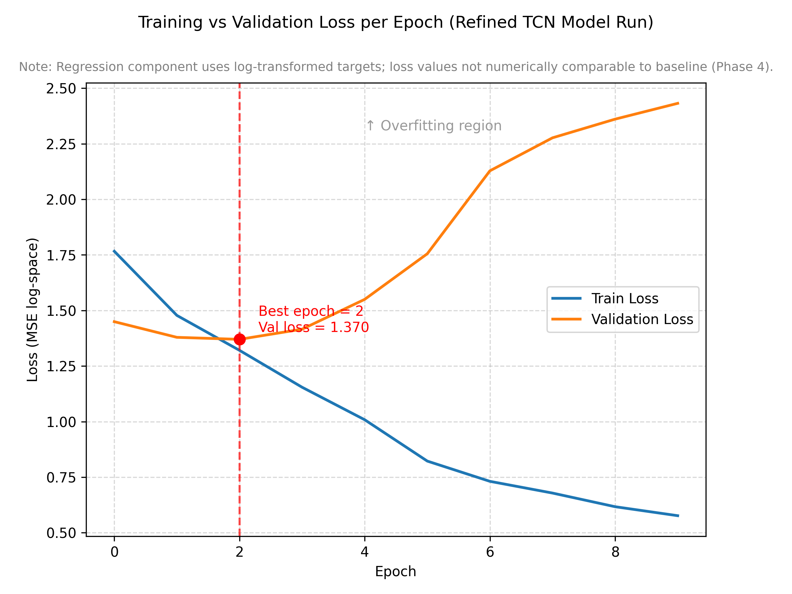

# Time-Series ICU Patient Deterioration Predictor

***Hybrid Machine Learning System for Early Warning in Critical Care***

---

## Executive Summary

**Tech stack:** *Python, PyTorch, Scikit-learn, LightGBM, pandas, NumPy*

This project implements a dual-architecture early warning system comparing gradient-boosted decision trees (LightGBM) against temporal convolutional networks (TCN) for predicting ICU patient deterioration, across three NEWS2-derived clinical-risk outcomes (maximum risk attained, average sustained risk, % time spent in high-risk state). 

Models were trained on the MIMIC-IV Clinical Demo v2.2 dataset (100 patients), using dual feature engineering pipelines: 171 timestamp-level temporal features (24-hour windows) for TCN, and 40 patient-level aggregated features for LightGBM.

The hybrid approach reveals complementary strengths: LightGBM achieves superior calibration and regression fidelity (68% Brier reduction, +17% AUC, +44% R²) for sustained risk assessment, while TCN demonstrates stronger acute event discrimination (+9.3% AUC, superior sensitivity) for detecting rapid deterioration. Together, they characterise short-term instability and longer-term exposure to physiological risk.

The complete pipeline includes clinically validated NEWS2 preprocessing (CO₂ retainer logic, GCS mapping, supplemental O₂ protocols), comprehensive feature engineering, robust evaluation, and model-specific interpretability (SHAP for LightGBM; gradient×input saliency for TCN).

A deployment-lite inference system supports batch and per-patient predictions for reproducible, end-to-end use.

| Target           | Best Model | Key Metric(s)             | Notes |
|------------------|------------|--------------------------|-------|
| Maximum Risk     | TCN        | ROC AUC: 0.923           | Strong acute detection, high sensitivity |
| Median Risk      | LightGBM   | ROC AUC: 0.972, Brier: 0.065 | Superior sustained risk calibration |
| Percentage Time High | LightGBM | R²: 0.793                | Better regression fidelity for high-risk exposure |

**Key Contributions:**
- Full clinical-validity pipeline with robust NEWS2 computation
- Dual feature engineering workflow (patient-level vs timestamp)
- Dual-model training with model-specific hyperparameter tuning
- Transparent interpretability validated against domain knowledge
- Deployment-lite inference pipeline demonstrating end-to-end usability

---

## Table of Contents
1. [Introduction](#introduction)
2. [Clinical Motivation](#clinical-motivation)
3. [Data Pipeline Overview](#data-pipeline-overview)
4. [Phase 1: CO₂ Retainer Identification & NEWS2 Tracker](#phase-1-co2-retainer-identification--news2-tracker)
5. [Phase 2: ML-Ready Feature Engineering](#phase-2-ml-ready-feature-engineering)
6. [Phase 3: LightGBM Training & Validation](#phase-3-lightgbm-training--validation)
7. [Next Steps](#next-steps)

---


## 1. Clinical Background & Motivation

### 1.1 The Problem With NEWS2
ICU patient deterioration often emerges through subtle physiological changes hours before critical events. The National Early Warning Score 2 (NEWS2) is widely used in UK hospitals to detect and escalate care for deteriorating patients. Accurate, real-time scoring and risk stratification can:
- Enable earlier intervention and ICU escalation
- Support clinical decision-making with actionable, interpretable metrics
- Provide a foundation for advanced ML-based early warning systems


***Figure: NHS Digital, NEWS2 API guide (Open Government Licence v3.0)***  

Although the national standard for deterioration detection, NEWS2 has well-recognised constraints:
- **No temporal modelling:** Although observations are charted sequentially, the scoring algorithm treats each set of vitals independently and does not incorporate trend, slope, variability, or rate-of-change.
- **Discrete scoring limitations:** continuous physiological signals are combined into discrete scores and does not model interactions between multiple variables, limiting sensitivity to subtle multivariate deterioration patterns.
- **Escalation overload:** Threshold-based triggers produce high false-positive rates in elderly and multimorbid cohorts, contributing to alert burden and escalation fatigue.
- **Limited predictive horizon:** Escalation only occurs after thresholds are breached, restricting early-warning capability.

##
### 1.2 Clinical Escalation Context
#### 1.2.1 How NEWS2 Scoring Is Used
NEWS2 scoring bands map directly to clinical monitoring frequency and escalation actions; these operational consequences define the clinical targets we aim to predict:

| NEWS2 Score                      | Clinical Risk | Monitoring Frequency                                  | Clinical Response                                                                 |
|-----------------------------------|-----------------|---------------------------------------------------------------|------------------------------------------------------------------------------------|
| **0**                             | Low           | Minimum every 12h                             | Routine monitoring by registered nurse.                                            |
| **1–4**                           | Low           | Minimum every 4-6h                            | Nurse to assess need for change in monitoring or escalation.                       |
| **Score of 3 in any parameter**   | Low–Medium    | Minimum every 1h                               | Urgent review by ward-based doctor to decide monitoring/escalation.            |
| **5–6**                           | Medium        | Minimum every 1h                               | Urgent review by ward-based doctor or acute team nurse; consider critical care team review.   |
| **≥7**                            | High          | Continuous monitoring                              | Emergent assessment by clinical/critical-care team; usually transfer to HDU/ICU. |

#### 1.2.2 Why This Matters
- Transitions between these risk categories directly influence clinical workload and resource allocation, including urgent reviews and ICU involvement.  
- Predicting imminent transitions into these categories (e.g., entering high risk within the next 4–6 hours) enables earlier intervention, reducing delayed escalations and improving critical-care resource planning.  

#### 1.2.3 Why NEWS2 Is The Reference Standard
- NEWS2 is the national standard for ward-based clinical deterioration assessment and provides a clinically validated ground-truth for model training and evaluation. 
- The ML models predict summary outcomes derived from NEWS2 clinical-risk categories:
  - `max_risk`: Maximum risk attained during stay 
  - `median_risk`: Average sustained risk across the stay  
  - `pct_time_high`: Percentage of time spent in high-risk state  
- Evaluating ML predictions against these NEWS2-derived outcomes allows assessment of **predictive horizon**, **sensitivity**, and the ability to anticipate **clinically actionable deterioration trends** before standard escalation would occur.

##
### 1.3 Why Machine Learning Is Used
ICU deterioration involves complex and often subtle, multivariate temporal patterns that standard threshold-based systems cannot fully capture. Machine learning enables prediction of clinically meaningful NEWS2-derived outcomes using both static and temporal representations of patient physiology.

| Model | Type   | Input Features   | Modelling Type   | Strengths     | Weaknesses     | Interpretability |
|-------|--------------|-------------------|------------------------|-------------------------|----------------------------|---------------|
| **LightGBM** | Gradient-Boosted Decision Tree (GBDT) | Aggregated patient-level | Static | Fast, interpretable, good calibration | Cannot capture sequential dynamics | SHAP |
| **TCN** | Temporal Convolutional Network | Timestamp-level sequential | Temporal | Captures temporal trends, slopes, variability | More computationally intensive than tree-based, less interpretable, requires careful hyperparameter tuning | Saliency (grad×input) |

#### 1.3.1 LightGBM (Classical ML)
- Strong baseline for structured, tabular data like patient-level aggregations of vitals and summary statistics.
- Captures non-linear interactions between vital signs  
- Fast to train and tune, handles missing values natively
- Highly interpretable via SHAP, critical for clinician understanding  
- Often competitive or superior when temporal structure is weak  

#### 1.3.2 TCN (Temporal Deep Learning)
- Models long-range temporal context and time-dependent patterns
- Robust to irregular sampling frequency (measurement intervals)
- Learns patterns in timestamp-level features, detecting short-term deterioration trends and acute changes that static models may miss.

#### 1.3.3 Why Compare Both?
- LightGBM evaluates performance on static, aggregated patient-level data.
- TCN uses temporal modelling to capture complex, sequential patterns from timestamp-level data.
- Comparison reflects realistic deployment: classical ML may suffice for long-term sustained deterioration patterns, whereas temporal models exploit high-resolution monitoring to detect early deterioration.
- This identifies where temporal modelling adds value, where classical ML suffices, and the trade-offs between performance and interpretability.

This project therefore systematically evaluates temporal vs. non-temporal ML approaches for predicting ICU deterioration using clinically meaningful NEWS2-derived targets.

---

## 2. Project Goals & Contributions

### 2.1 Primary Objectives
1. Establish a clinically validated deterioration-prediction framework by using NEWS2-derived risk categories as the reference standard for all model targets and evaluation.
2. Compare classical vs. deep learning to quantify the added predictive value of temporal modelling by systematically comparing a static gradient-boosted decision tree model (LightGBM) against a temporal convolutional network (TCN) on the same patients and targets.
3. Design dual feature engineering pipelines (timestamp-level for TCN, patient-level for LightGBM) incorporating temporal statistics, imputation, and missingness flags; aligned with real hospital data quality constraints.
4. Evaluate model performance across 3 risk horizons to ensure fair model comparison, demonstrating how different architectures capture acute vs. long-term physiological instability.
5. Implement transparent model-specific interpretability pathways (SHAP vs. saliency) to ensure outputs remain clinically aligned and defensible, supporting clinician trust during decision-making and escalation.
6. Develop an end-to-end, deployment-lite inference system capable of running batch and per-patient predictions, enabling direct applicability to real-world ICU or ward settings.

##
### 2.2 Key Technical Contributions
- **Dual-Model Feature Engineering:** Built a reproducible pipeline from raw EHR data, including feature extraction, NEWS2 computation (GCS→LOC mapping, CO₂ retainer and supplemental O₂ rules), and clinically interpretable timestamp- and patient-level features (LOCF, missingness flags, rolling windows, summary statistics).
- **LightGBM Baselines:** Developed robust patient-level models with binary target handling for sparse classes, stratified cross-validation, and hyperparameter tuning for stable, reproducible performance.
- **TCN Architecture:** Designed multi-task temporal convolutional network for time-series data, combining causal dilated convolutions, residual connections, and masked mean pooling.
- **Evaluation & Diagnostics:** Built unified evaluation utility for reproducible metrics; diagnosed and corrected TCN metric misalignment to restore true ROC-AUC.
- **Model Retraining & Stability:** Implemented targeted TCN retraining with class-weighted BCE and log-transform regression, preserving architecture and hyperparameters while improving convergence and predictive reliability.
- **Comprehensive Analysis Pipeline:** Executed unbiased test set inference, TCN calibration/threshold tuning, and cross-model comparative analysis for LightGBM vs. TCN.
- **Interpretability & Deployment:** Delivered global SHAP feature explanations (LightGBM) and gradient×input saliency maps (TCN), and packaged a unified, lightweight inference pipeline supporting batch and interactive per-patient predictions with deterministic, dataset-agnostic outputs.

---

## 3. Phase 1 - Data Extraction & NEWS2 Computation

### 3.1 Data Source: MIMIC-IV Demo (v2.2)
- **Overview:** Medical Information Mart for Intensive Care (MIMIC)-IV database is comprised of deidentified patient electronic health records, taken from PhysioNet.org.
- **Contents:** 26 tables of structured vital signs, labs, and admission data; excludes free-text clinical notes.
- **Patients:** 100 ICU admissions (de-identified subset)
- **Tables used:** `chartevents`, `patients`, `admissions`, `d_items`
- **Limitations:** Small sample size (full dataset contains >65,000 ICU admissions), limited high-risk events.

##
### 3.2 NEWS2 Pipeline Overview
**Goal:** Extract relevant vital signs, encode clinical rules, compute NEWS2 scores per timestamp and per patient producing reproducible outputs for feature engineering.

```text 
                          Raw MIMIC-IV CSVs
                    (chartevents, patients, etc.)
                                  │
                        extract_news2_vitals.py
                                  │                               
                                  ▼                               
          news2_vitals_with_co2.csv + co2_retainer_details.csv
                                  │
                          compute_news2.py
                                  │
                  ┌───────────────┴───────────────┐
                  ▼                               ▼
  news2_scores.csv (timestamp-level)   news2_patient_summary.csv (patient-level)
```

##
### 3.3 Clinical Feature Extraction & NEWS2 Computation

The pipeline extracts all NEWS2-relevant physiological variables using universal encoding labels, including custom CO2 retainer logic implementation. NEWS2 parameter scoring and total scoring is implemented, with both timestamp-level and patient-level files being created.

#### 3.3.1 Core Vital Parameters
| Parameter               | Range                        | NEWS2 Points |
|-------------------------|-----------------------------|--------------|
| Respiratory Rate        | ≤8 → ≥25                    | 0–3          |
| SpO₂ (Scale 1)          | ≤91 → ≥96                   | 0–3          |
| SpO₂ (Scale 2, hypercapnic) | ≤83 → ≥97               | 0–3          |
| Supplemental O₂         | No / Yes                     | 0 / 2        |
| Temperature             | ≤35°C → ≥39.1°C             | 0–3          |
| Systolic BP             | ≤90 → ≥220                  | 0–3          |
| Heart Rate              | ≤40 → ≥131                  | 0–3          |
| Level of Consciousness  | Alert / Not Alert        | 0 / 3        |

(Discrete NHS NEWS2 bands are applied in code; the table above shows compressed min–max ranges.)

#### 3.3.2 Clinical Logic Implementation
1. **CO₂ Retainer Identification**
```text 
All ABG measurements in `chartevents.csv` examined. Criteria (all must be met):
- PaCO₂ > 45 mmHg (chronic hypercapnia)
- pH 7.35-7.45 (compensated respiratory acidosis)  
- ABG measurements ±1 hour apart
→ Triggers SpO₂ Scale 2 (target 88-92% vs 94-98%). No patients in current dataset met criteria.
```
2. **GCS → Level of Consciousness (LOC) Mapping**
```text
Combine column scores (`GCS - Eye Opening`, `GCS - Verbal Response`, `GCS - Motor Response`) to create `gcs_total`. 
- GCS ≥15: Alert (LOC = 0)
- GCS <15: Not Alert (LOC = 3)
→ Non-alert states add +3 to NEWS2
```
3. **Supplemental O₂ Detection**
```text 
FiO₂ can be identified via `Inspired O2 Fraction` in CSV and converted to binary supplemental O₂ indicator. 
- ≤0.21 = not on supplemental O₂ (0)
- >0.21 = on supplemental O₂ (1)
→ Any supplemental O₂ adds +2 to NEWS2
```
#### 3.3.3 Output Format
**Timestamp-level: `news2_scores.csv`**
- One row per observation timestamp
- Raw vitals, individual parameter scores, total NEWS2 score
- Supplemental O₂, CO₂ retainer, and consciousness/GCS labels.
- Escalation risk category (low/medium/high), monitoring frequency, response.

**Patient-level: `news2_patient_summary.csv`**
- **Per-patient aggregations:** min, max, mean, median, total number of timestamps
- Summary statistics per patient.

---

## 4. Phase 2 - Feature Engineering (Timestamp & Patient-Level)
### 4.1 Feature Overview
**Purpose:** Transform NEWS2 data into patient-level + timestamp-level ML-ready feature-sets for tree-based models (LightGBM) and Neural Networks (TCN).

```text
                              news2_scores.csv
                                       │
             ┌─────────────────────────┴─────────────────────────┐
             │                                                   │
  make_patient_features.py                           make_timestamp_features.py
             │                                                   │
             ▼                                                   ▼
  Patient-Level Feature Engineering                  Timestamp-Level Feature Engineering
  - Median, mean, min, max per vital                 - Missingness flags 
  - Imputation using patient-specific median         - Last Observation Carried Forward (LOCF)
  - % Missingness per vital                          - Carried-forward flags
  - Encode risk labels and summary target stats      - Rolling windows 1/4/24h (mean, min, max, std, slope, AUC)
      • max_risk                                     - Time since last observation (staleness)                                  
      • median_risk                                  - Encode risk labels
      • pct_time_high                                            │
             │                                                   │
             ▼                                                   ▼
  news2_features_patient.csv                        news2_features_timestamp.csv
             │                                                   │
             ▼                                                   ▼
  LightGBM Model (Classical ML)                     Temporal Convolutional Network (TCN)                         
```

- **Timestamp-level features**: Provide the richest representation, capturing short-, medium-, and long-term deterioration patterns. Essential for sequence-based models like deep learning architectures (e.g., TCN).  
- **Patient-level features**: Aggregated summaries of vital signs, useful for testing simpler models, evaluating feature importance, and establishing baseline metrics.  

Maintaining both feature sets ensures flexibility and robustness in model selection:  
- **LightGBM** → clinician-friendly, interpretable baseline using patient-level features.  
- **TCN** → modern deep learning approach leveraging full temporal sequences to capture dynamic deterioration trends.

##
### 4.2 Timestamp-Level Features (for TCN)
**Purpose:** Capture temporal dynamics for sequential modeling

#### 4.2.1 Feature Computation

**Imputation Strategy**
- **Missingness flags:** Binary indicators (1/0) for each vital parameter (value carried forward=1) so models can learn from missing patterns. Before carried-forward so that it is known which values were originally missing.
- **LOCF (Last Observation Carried Forward) flags:** Propagate previous valid measurement, and create a binary carried-forward flag (binary 1/0). 

**Rolling Window Features (1/4/24h)**
- **Mean:** Average value
- **Min/Max:** Range boundaries
- **Std**: Variability
- **Slope:** Linear trend coefficient
- **AUC (Area Under Curve):** Integral of value over time

**Other Features**
- **Staleness:** Time since last observation (staleness per vital)
- **Numeric risk encoding:** Encoded as 0 (low), 1 (medium-low), 2 (medium), 3 (high)

#### 4.2.2 Output Format
- **Timestamp-level:** `news2_features_timestamp.csv`
- ML-ready per patient per timestamp features (ordered by `subject_id` and by `charttime`).
- Full time-series per patient allows modelling of temporal patterns, trends, dynamics
```text 
(total_timestamps, n_features) = (20,814 timestamps, 136 features)
``` 
- **136 features =**
  - Rolling windows → 5 vitals x 3 windows x 6 stats = 90
  - 8 vitals x (staleness + missingness flag + LOCF flag) = 24
  - 14 raw clinical signals + 3 derived clinical labels = 17
  - NEWS2 → NEWS2 score + risk label + monitoring frequency + response + numeric risk = 5

##
### 4.3 Patient-Level Features (for LightGBM)
**Purpose:** Aggregated risk profile for interpretable tree-based modeling

#### 4.3.1 Feature Computation
- **Vital sign aggregations (per parameter):** Median, mean, min, max
- **Patient-specific median imputation**: Fill missing values for each vital (preserves patient-specific patterns), if a patient never had a vital recorded, fall back to population median.
- **% Missingness per vital:** track proportion of missing values pre-imputation, data quality indicator, signal from incomplete measurement pattern.
- **Escalation summary metrics:** convert risk label to numeric then compute
  - `max_risk` = maximum risk attained
  - `median_risk`= average sustained risk
  - `pct_time_high` = % time spent in high-risk state

#### 4.3.2 Output Format
- **Patient-level:** `news2_features_patient.csv`
- ML-ready per patient aggregated summary features (ordered by `subject_id`)
- One row per patient (fixed-length vector).
```text
(n_patients, n_features) = (100, 43)
```
- **43 features =**
  - 8 vitals x (median + mean + min + max + % missing) = 40
  - Summary features → `max_risk` + `median_risk` + `pct_time_high` = 3

---

## 5. ML Modelling Strategy

### 5.1 Bimodal Architecture Rationale
#### 5.1.1 Overview Table
| Model      | Input Resolution                | Architecture Type                | Mechanism                                                                 | Primary Strength                                        | Clinical Application                                             |
|------------|---------------------------------|---------------------------------|---------------------------------------------------------------------------|--------------------------------------------------------|-----------------------------------------------------------------|
| **LightGBM** | Patient-aggregated (40 features) | Gradient-boosted decision trees | Builds an ensemble of decision trees sequentially using gradient-based optimization; each tree corrects residual errors of previous trees to minimize loss | Calibrated probability estimates, strong interpretability, robust baseline | Sustained risk stratification, resource allocation, triage scoring |
| **TCN**      | Timestamp-sequential (96×171 tensor) | Temporal convolutional network | Applies causal, dilated convolutions with residual connections over sequential inputs to capture long-range temporal dependencies efficiently | Temporal pattern detection, high acute-event sensitivity | Real-time monitoring, rapid deterioration alerts, dynamic forecasting |

#### 5.1.2 Narrative Motivation
- **LightGBM (Classical ML):** Establishes transparent, clinician-interpretable baseline and identifies which vitals matter most at the patient-level.
- **TCN (Deep Learning):** Advances to time-series modeling which captures temporal dependencies, demonstrating how deterioration unfolds dynamically over time, which captures dynamics that aggregated features can’t.
- Combining the two showcases progression from classical tabular ML → modern sequence-level deep learning, proving competence across both paradigms.

#### 5.1.3 Clinical Motivation
- **Acute detection:** Requires high-sensitivity to short-term trend changes (TCN advantage)
- **Sustained risk:** Requires calibrated probability estimates over full stay (LightGBM advantage)
- Dual architecture approach represents two distinct clinical tasks; sustained risk assessment + acute monitoring, pipeline leverages each model's inherent strengths by aligning to its optimal prediction task.

##
### 5.2 Baseline Classical ML Model Selection
#### 5.2.1 Classical Models Considered
| Model   | Strengths                              | Limitations                                      | Decision Rationale                                     |
|------------------|----------------------------------------|-------------------------------------------------|------------------------------------------------------------|
| Logistic Regression (Linear) | Simple, fast, easy to deploy, interpretable coefficients | Linear assumptions; cannot model non-linear vital-sign interactions, tends to underperform on raw time-series vitals | Insufficient for complex ICU physiological patterns |
| Random Forest (Bagged Trees) | Robust, ensemble tree-based method; handles nonlinearities; less sensitive to scaling | Slower and less sample-efficient than boosted trees; weaker performance on small datasets | Boosted trees outperform on structured EHR data |
| XGBoost (Boosted Trees) | Industry-standard GBDT; good regularisation; mature ecosystem | Slower training, higher memory usage | Comparable, but suboptimal for small 100-patient dataset |
| CatBoost (Boosted Trees) | Excellent handling of categorical features; stable training | Benefits irrelevant when features are already numeric | No categorical variables → added complexity gives no gain |
| LightGBM (Boosted Trees) | Fastest GBDT, highly efficient, handles NaNs natively, efficient SHAP integration | Requires careful hyperparameter tuning to avoid overfitting on small samples | Best choice for small tabular datasets with missingness |

#### 5.2.2 Decision: LightGBM (Gradient Boosted Decision Tree (GBDT) library)
- Most efficient GBDT for small tabular datasets → faster and lighter than XGBoost/CatBoost, ideal for a 100-patient regime.
- Native missing-value handling (NaNs) → tree-splitting logic automatically routes missing values, avoiding imputation pipelines (beyond simple patient-median fallback).
- Rapid training/evaluation → enables fast experimentation and iteration across multiple targets and CV folds.
- Efficient SHAP integration for interpretability → SHAP values directly explain tree splits, giving exact feature attribution, critical for clinical transparency. 
- Proven performance → boosted trees consistently outperform linear models and shallow learners on structured EHR/ICU tabular data

##
### 5.3 Advanced Deep Learning Model Selection
#### 5.3.1 Neural Architectures Considered
| Standard / Core              | Strengths                                       | Limitations                                                      | Decision Rationale                          |
|--------------------|-------------------------------------------------|-----------------------------------------------------------------|---------------------------------------------------------|
| LSTM/GRU (Recurrent) | Well-suited for sequences, handles variable-length inputs | Vanishing gradients on long sequences, slow sequential training | Unstable gradients on long ICU sequences, computationally inefficient, dataset too small for deep RNN stacks |
| Transformer (Self-attention) | Powerful for long sequences, models global dependencies | Requires large datasets for self-attention to learn effectively, computationally intensive, prone to overfitting | Overkill for small dataset; unnecessary complexity |
| TCN (Convolutional) | Parallelizable, dilated convolutions, stable gradients, captures long-range temporal dependencies | Requires sequence padding, normalisation, masking for missingness | Efficient and robust for small-sample ICU time-series; best balance of performance and practicality | 

| Specialised / Niche           | Strengths                                       | Limitations                                                      | Decision Rationale                        |
|--------------------|-------------------------------------------------|-----------------------------------------------------------------|---------------------------------------------------------|
| Neural ODE (continuous-time) | Continuous-time dynamics instead of discrete layers | Niche research technique, slow, unstable complex training (ODE solvers) | Rarely production-ready, not clinically validated |
| Graph Neural Network (GNN) | Models patient-patient similarity or hospital network relationships | Requires graph structure, not sequences or grids; operates on node/edges | Inapplicable to independent patient time-series |
| WaveNet (Autoregressive) | Deep, heavy convolutional autoregressive model for audio | Designed for massive datasets (speech), computationally huge | Impractical and slow for 100-patient clinical dataset |

#### 5.3.2 Decision: TCN (Temporal Convolutional Neural Network)
- Modern, credible sequence architecture → advanced enough to demonstrate deep-learning capability without appearing niche or experimental.
- Dilated causal convolutions → capture long physiological context windows while preventing future leakage.
- Fully parallel convolutional operations → train faster and more efficiently than sequential RNNs.
- Residual connections stabilise gradients → avoid vanishing/exploding issues common in RNNs (LSTMs/GRUs).
- Fewer parameters than Transformers → suitable for small clinical datasets without overfitting risk.
- Inductive bias for local temporal patterns → aligns with how ICU deterioration emerges through short-term trends and slopes.
- Exponential receptive field → models long ICU stays without needing deep recurrent stacks.
- Temporal saliency maps → reveal when features influenced predictions, enabling time-aware interpretability.
- Strong empirical support → consistently outperforms RNNs on moderate-length clinical sequences; well-validated in medical ML literature (unlike Neural ODEs, GNNs, WaveNet).

#### 5.3.3 Mechanism of TCN
**Temporal awareness**:
-	Causal convolutions → at each time step, the model only looks backwards in time (no data leakage from the future).
-	Dilated convolutions → skip connections expand the receptive field exponentially, captures long-range temporal patterns without deep stacking (without needing hundreds of layers).

**Stable training**:
- Residual blocks → stabilise gradient flow, prevent vanishing/exploding gradients, making the deep temporal model easier to optimise.

**From sequences to predictions**:
-	Global pooling → compresses full sequence into a single fixed-length representation.

##
### 5.4 Patient-Level Outcome Design

**Rationale:** Patient-level outcomes ensure that the TCN’s predictions are directly comparable with LightGBM while still taking advantage of temporal trends in ICU sequences.

**TCN Approach**
- **Input / Features:** Timestamp-level sequences → captures full temporal patterns.  
- **Targets:** Patient-level outcomes (`max_risk`, `median_risk`, `pct_time_high`).  
- **Training approach:** Each timestep inherits the patient label → TCN maps whole sequence → patient-level prediction.  

**Why not per-timestep prediction**  
- True sequence-to-sequence labeling would predict risk per timestep for richer early-warning capability.
- Challenges: require detailed labels for every timestamp (rare in ICU datasets), per-timestep prediction in a small dataset is prone to overfitting and instability; and evaluation is complex.

| Aspect                | LightGBM (Classical ML)                   | Current TCN                               | Full TCN Potential                            |
|-----------------------|-------------------------------------------|-------------------------------------------|-----------------------------------------------|
| Input format          | Patient-level aggregates `news2_features_patient.csv` | Timestamp-level sequences (padded) `news2_features_patient.csv` | Timestamp-level sequences (padded) `news2_features_patient.csv` |
| Targets               | `max_risk`, `median_risk`, `pct_time_high` | `max_risk`, `median_risk`, `pct_time_high` | Per-timestep risk (hourly escalation)       |
| Features              | Aggregated stats (mean, median, min, max, % missing) | Rolling windows + LOCF + missingness + staleness | Same + explicit per-timestep features       |
| Temporal modeling     | None (static aggregates)                   | Captures temporal trends across full sequences | Captures full temporal patterns and enables per-timestep early-warning predictions    |
| Interpretability      | SHAP (feature-level)    | Saliency maps over features & time (sequence-level) | Saliency + per-timestep attributions (fine-grained temporal insight) |
| Computational complexity | Low                                      | Moderate                                   | High                                         |
| Strengths             | Robust, credible baseline                  | Detects deterioration trajectories        | Detects trajectories + predicts escalation  |
| Portfolio value       | Demonstrates baseline competency          | Shows advanced temporal modeling          | Demonstrates sequence-level ML mastery      |

**Why patient-level labels are appropriate:**  
- **Clinical relevance:** Clinicians care whether escalation occurred, not exactly when.  
- **Data constraints:** Sparse or missing per-timestep labels make sequence-to-sequence modeling unreliable.
- **Comparison clarity:** Aligns TCN outcomes with LightGBM for direct performance comparison.  
- **Portfolio value:** Demonstrates temporal modeling capability without unnecessary complexity.  
- **Practicality:** Reduces coding/debugging overhead while preserving temporal advantage.

**Key insight:**  
- Patient-level TCN outputs leverage temporal patterns that LightGBM cannot capture.  
- Sequence-to-sequence prediction is technically feasible but impractical here; this approach balances complexity with feasbility and dataset constraints. 

##
### 5.5 Final Model Comparison: LightGBM vs TCN

| Dimension                    | LightGBM (GBDT)                                                | TCN (Temporal CNN)                                                  |
|-----------------------------|------------------------------------------------------------------|---------------------------------------------------------------------|
| **Data Requirement**        | Works well on small tabular datasets (≤100 patients)             | Requires timestamp-level sequences; benefits from richer data       |
| **Temporal Awareness**      | None — uses aggregated features                                  | Strong — captures short- and long-range trends via dilated convs    |
| **Training Efficiency**     | Extremely fast, low compute                                      | Moderate — parallel but more computationally heavy                  |
| **Overfitting Risk**        | Low with tuned parameters                                        | Higher if sequences are long or dataset small                       |
| **Interpretability**        | Excellent (SHAP, tree splits)                                    | Moderate (saliency maps)                                            |
| **Clinical Strength**       | Calibrated sustained-risk estimation                             | Acute deterioration detection in real time                          |
| **When It Excels**          | Low-frequency data, small datasets, need for transparency        | High-frequency temporal data, subtle deterioration patterns         |
| **When It Struggles**       | Fails to capture time-dependent dynamics                         | Requires more preprocessing (padding, normalisation, masking) and careful architecture tuning (kernel size, dilation, layers) |

---

## 6. Phase 3 — LightGBM Pipeline: Baseline Modelling & Hyperparameter Tuning
### 6.1 Pipeline Overview
**Purpose:** Establish classical ML baseline, identify dataset properties, and produce stable hyperparameters for downstream evaluation.

```text
                                      news2_features_patient.csv
                                                  │
              ┌──────────────────────────┬────────┴───────────────┬───────────────────────┐
  complete_train_lightgbm.py    feature_importance.py   train_final_models.py       tune_models.py
              │                          │                        │                       │
              ▼                          ▼                        ▼                       ▼
  Preprocessing + CV Training   Feature Importance      Final Models               Hyperparameter Tuning
  (baseline models)             (per-fold)              (3 deployed LGBMs)         (only retained output)
  - Class collapse +            - Aggregated across     - Full-dataset models      - 5-fold CV grid search
  binarisation                  folds                   - Deployment-ready .pkls   - Tuning run logs per target
  - 5-fold CV (15 models)       - Bar plots + CSVs                │                - best_params.json
  - Fold metrics                       │                          │                       │
              │                        │                          │                       │
              ▼                        ▼                          ▼                       ▼
    Superseded by Phase 5     Superseded by Phase 6     Superseded by Phase 5    Retained for Phase 5
    (evaluation pipeline)     (SHAP interpretability)   (retraining)             (retraining and evaluation) 
```

- **Class handling:** Identified severe class imbalance and rare-events carcity → applied target binarisation and stratified 5-fold CV to stabilise evaluation.
- **Baseline modelling:** Trained initial LightGBM classifiers/regressors on patient-level features (5-fold CV → 15 baseline models + metrics).
- **Hyperparameter tuning:** Per-target tuning of `learning_rate`, `max_depth`, `n_estimators`, `min_data_in_leaf` → produced `best_params.json` used in later phases.
-	**Feature importance:** Generated fold-averaged LightGBM feature importance to confirm model signal (later superseded by Phase 6 SHAP).
-	**Final models:** Trained full-cohort deployment-style final models using tuned hyperparameters (later superseded by Phase 5 retraining).

##
### 6.2 Baseline Cross-Validation 
- A 5-fold CV LightGBM baseline was run to validate pipeline correctness, expose dataset issues, and establish a minimal working baseline before tuning.
- **Models were trained on `news2_features_patient.csv` for 3 targets:**
  - Classification: `max_risk` + `median_risk` → 5-fold StratifiedKFold
  - Regression: `pct_time_high` → 5-fold KFold
- **Baseline runs revealed major dataset properties:**
	- Strong class imbalance and rare-event sparsity in both classification targets `max_risk` + `median_risk`.
	- Clinically expected: severe deterioration (`max_ris`k=3) and sustained high-risk burden are uncommon.
- **Required class consolidation + binarisation:**
	-	Binarisation improves model stability, simplifies clinical interpretation, and aligns with binary alert systems.
- **Required StratifiedKFold:**
  - Essential to ensure each fold contained minority-class examples, avoid folds with absent classes, and reduce evaluation variance; critical with only 100 patients.
- Identifying these issues early ensured consistent binarisation and stratified sampling throughout later phases, making subsequent pipelines robust and reproducible on small, imbalanced clinical datasets.

| Target         | Original Classes        | Consolidated Classes                       | Binary Encoding Used in Training |
|----------------|--------------------------|---------------------------------------------|----------------------------------|
| **max_risk**   | 0, 1, 2, 3               | 0/1/2 → 2 (not high risk), 3 → 3 (high risk) | 2 → 0, 3 → 1                     |
| **median_risk**| 0, 1, 2, 3               | 0+1 → 1 (low), 2 → 2 (medium), 3 removed (no high risk in data) | 1 → 0, 2 → 1                     |

##
### 6.3 Hyperparameter Tuning
#### 6.3.1 Tuning Process
- This is the only Phase 3 component used in later phases (Phase 5 LightGBM evaluation).
- Tuned the four parameters with the highest impact on stability and generalisation for small tabular datasets:
	- `learning_rate` → controls step size; balances speed vs overfitting.
	- `max_depth` / `num_leaves` → limits tree complexity; prevents overfitting small dataset.
	- `n_estimators` → total number of trees.
	-	`min_data_in_leaf` → ensures each leaf has enough samples, 
-	**5-fold CV evaluation:**
	-	Classification (`max_risk`, `median_risk`) → AUROC / Accuracy
	-	Regression (`pct_time_high`) → RMSE
- **Why tuning was essential:**
	-	Only 100 patients → high overfitting risk.
	-	These parameters dominate LightGBM performance on small data.
	-	Ensures LightGBM is fairly compared against TCN models in later phases.
- Generates stable, reproducible, validated parameter sets that optimise baseline performance without overfitting, especially critical with only 100 patients.

#### 6.3.2 Best hyperparameters

| Target         | learning_rate | max_depth | n_estimators | min_data_in_leaf |
|----------------|---------------|-----------|--------------|-------------------|
| **max_risk**       | 0.1           | 5         | 50           | 20                |
| **median_risk**    | 0.05          | 5         | 100          | 5                 |
| **pct_time_high**  | 0.1           | 3         | 200          | 5                 |

##
### 6.4 Feature Importance
- Fold-level LightGBM feature importance was generated to confirm that models were learning meaningful clinical signal and to verify early pipeline sanity.
- Provided an initial interpretability check and highlighted key predictors per target.
- These plots served as exploratory, legacy interpretability and were later superseded by SHAP analysis in Phase 6.

##
### 6.5 Deployment-style LightGBM models 
-	Trained one final model per target (3 total) on the full cohort using tuned hyperparameters.
-	Maximised use of all available data and produced deployment-ready artefacts for demonstration of real-world deployment practice.
- These models served as complete baseline artefacts, although final benchmarking used the unified evaluation pipeline in phase 5, not these models.
- These final models validate pipeline completeness and full ML workflow coverage (baseline → tuning → deployment) even if later superseded by retraining in phase 5.

##
### 6.6 Summary 
#### 6.6.1 Retained Outputs

| Item                                | Rationale                                                     |
|-------------------------------------|----------------------------------------------------------------|
| **Hyperparameters (`best_params.json`)** | Used in Phase 5 LightGBM–TCN fair comparison                  |

#### 6.6.2 Superseded Outputs

| Item                                | Replaced By / Reason                                          |
|-------------------------------------|----------------------------------------------------------------|
| Baseline 5-fold models              | Phase 5 retrained models on same split as TCN                   |
| Fold-level feature importance       | Phase 6 SHAP (model-consistent interpretability)              |
| Full-cohort final models            | Phase 5 retrained models on same split as TCN                 |

##
### 6.7 Why Phase 3 Matters
- Phase 3 established the first credible classical ML baseline, exposed the dataset’s true behaviour, and produced the validated LightGBM hyperparameters reused in final benchmarking. 
- **It delivered the two foundations that shaped all later phases:**
	-	Target binarisation (after diagnosing rare-event imbalance).
	-	Stable tuned hyperparameters (ensuring fair LightGBM vs TCN comparison).
- Even though most intermediate outputs were superseded, Phase 3 remains essential because it validated the problem framing and confirmed learnable signal before evolution of the project.
- Grounds the project in rigorous baseline modelling before moving to temporal architectures.

---

## 7. Phase 4 — Temporal Convolutional Network (TCN) Pipeline: Architecture & Training
### 7.1 Pipeline Overview
**Purpose:**
- Build, configure, and train a causal deep-learning model that captures temporal deterioration patterns beyond what classical ML can learn.
- Deliver a fully reproducible end-to-end pipeline: data preparation → model design → training → validation → diagnostics → refinement

**Why This Phase Matters:**
- Classical models (e.g., LightGBM) cannot model temporal dynamics; the TCN extends the system to sequence-level reasoning
- Initial TCN runs revealed class imbalance and regression skew, requiring corrective steps (pos-weighting, log-transform)
- This phase demonstrates mature ML workflow: identify issues → diagnose → correct → retrain

**End Products of Phase 4:**
- Clean model-ready preprocessed data and patient splits
- Clean padded/masked tensor datasets for sequence modelling
- Fully defined multi-task causal TCN architecture
- Stable, reproducible training pipeline with saved configs, history and loss curve plot

##
### 7.2 Preprocessing Pipeline 
#### 7.2.1 Overview
**Purpose:** produces fixed-length, ordered patient sequences with masks from raw timestamps → clean, leakage-free, reproducibly scaled inputs for the TCN.

```text
                  Input Files:
                  - news2_features_timestamp.csv
                  - news2_features_patient.csv
                                 │
                                 ▼
            Preprocessing (prepare_tcn_dataset.py)
            - Chronological ordering
            - Merge patient-level outcomes
            - Binary target creation (same as LightGBM)
            - Patient-level stratified splits (train/val/test)
            - Feature cleaning + type enforcement
            - Z-score scaling (normalisation)
            - Per-patient sequence grouping
            - Padding/truncation to MAX_SEQ_LEN + mask creation
                                 │
             ┌───────────────────┴────────────────────┐
             │                                        │
             ▼                                        ▼
  Padded sequences and masks                Preprocessing artifacts
  - train.pt / train_masks.pt               - standard_scaler.pkl
  - val.pt / val_masks.pt                   - padding_config.json
  - test.pt / test_masks.pt                 - patient_splits.json
             │                                        │
             ▼                                        ▼
  Used by TCN training/validation/testing   Used at inference for identical preprocessing
```

#### 7.2.2 Key Steps
1. **Chronological Ordering & Merge Outcomes**
  - Sort timestamps by `subject_id` and `charttime` to ensure correct temporal flow.
  - Add `max_risk`, `median_risk`, `pct_time_high` from patient-level data
2. **Patient-level Stratified Split**
  - Split: Train/validation/test → 70/15/15
  -	Stratified by the same binary risk labels used for LightGBM (see Section 6.2) → stratification prevents class imbalance, random state fixed for reproducibility 
  -	Splitting by patient prevents leakage across sequences
3. **Feature Cleaning**
  -	Identify all feature columns (exclude IDs and targets), remove unused categorical fields, convert certain labels to binary → 171 timestamp-level feaures
  -	Separate continuous (for z-score scaling) vs binary (no scaling needed) features.
4. **Normalisation**
  - Apply z-scoring to continuous variables (categorical features unchanged) on train/val/test splits → ensures features are on comparable scales, preserving trends.
  - Fit `StandardScaler()` on training patients only (avoids information leakage).
5. **Sequence Construction**
  -	Group rows per patient.
  -	Convert each patient to (timesteps × features) 2D NumPy arrays.
6. **Sequence Padding/Truncation and Masking**
  -	Use fixed length 96 hours → `MAX_SEQ_LEN = 96` for uniform input sizes
  -	Short sequences → zero-pad; long sequences → truncate.
  -	Masks mark real (1) vs padded (0) timesteps for loss computation.
7. **Stack Sequences + Mask tensors For Each Split (train/val/test):**
  -	Sequences: `train.pt`, `val.pt`, `test.pt` → shape `(num_patients, 96, num_features)`
  -	Masks: `train_mask.pt`, `val_mask.pt`, `test_mask.pt` → shape `(num_patients, 96)`
8. **Save Preprocessed Artifacts**
  - `patient_splits.json` → dictionary of patient IDs train/val/test split
  -	`standard_scaler.pkl` → z-scoring scalar (training-set mean/std)
  -	`padding_config.json` → sequence length (`max_seq_len`) + feature/target columns (`feature_cols`, `target_cols`)

##
### 7.3 Network Architecture
**Purpose:** fully convolutional, causal TCN for patient-level predictions with multi-task heads (classification + regression). 

```text
                             ┌──────────────────────────────┐                      ┌────────────────────┐                  
                             │ Input:                       │                      │ Input:             │
                             │ sequence tensor (B, L, F)    │                      │ mask tensor (B, L) │
                             └───────────────┬──────────────┘                      └──────────┬─────────┘
                                             │                                                │
                             ┌──────────────────────────────┐                                 │
                             │ Permute: to shape (B, F, L)  │                                 │
                             │ for Conv1d input             │                                 │
                             └───────────────┬──────────────┘                                 │
                                             │                                                │
                                             ▼                                                │
            ┌─────────────────────────────────────────────────────────────────┐               │
            │ Stacked Temporal Residual Blocks (3 blocks)                     │               │
            │ Temporal feature extraction; Each TemporalBlock:                │               │
            │  • 2x CausalConv1d (dilated 1D convolutions, length preserving) │               │
            │  • 2x LayerNorm (stabilises training)                           │               │
            │  • 2x ReLU activation (non-linearity)                           │               │
            │  • 2x Dropout (regularisation)                                  │               │
            │  • Downsample (1×1 convolution) if input ≠ output channels      │               │
            │  • Residual / skip connection (stable gradient flow)            │               │
            │ Dilation doubles per block (1 → 2 → 4) → exponentially          │               │
            │ increasing receptive field.                                     │               │
            └────────────────────────────────┬────────────────────────────────┘               │
                                             │                                                │
                             ┌──────────────────────────────┐                                 │
                             │ Permute: back to shape       │                                 │
                             │ (B, L, C_last)               │                                 │
                             └───────────────┬──────────────┘                                 │
                                             │                                                │
                                             ▼                                                │                    
                       ┌──────────────────────────────────────────┐                           │
                       │ Masked Mean Pooling                      │ ◀─────────────────────────┘         
                       │  • Collapses variable-length sequences   │
                       │  into a single-patient vector (B, C_last)├───────────────────────────┐
                       │  • Summarise patient-level features      │                           │
                       └─────────────────────┬────────────────────┘                           ▼
                                             │                           ┌────────────────────────────────────────┐
                                             ▼                           │ Optional Dense Head                    │
                              ┌──────────────────────────────┐           │  • Linear → ReLU → Dropout             │
                              │ Task-Specific Output Heads   │           │  • Mixes pooled features before output │
                              │ Classification (binary):     │           └────────────────────┬───────────────────┘
                              │  • classifier_max            │                                │
                              │  • classifier_median         │ ◀──────────────────────────────┘ 
                              │ Regression:                  │
                              │  • regressor (pct_time_high) │
                              └──────────────────────────────┘
```

#### 7.3.1 Architectural Structure
1. **Causal Convolution (`CausalConv1d`) Layer**
  -	1D convolutions padded only on the left, trims the right → avoids future data leakage.
  -	Each kernel learns a local temporal pattern (e.g., sudden HR spike, BP drop).
  -	Preserves temporal causality critical for ICU time series.
2. **Temporal Residual Block**
  - Core computational unit `TemporalBlock` contains:
    -	Two causal convolutions (local feature extraction).
    -	LayerNorm (stabilises activations → prevents exploding/vanishing gradients)
    - ReLU activation (non-linear feature learning → model learns complex patterns)
    -	Dropout (regularisation → avoids overfitting by randomly zeroing some activations)
    -	Downsample (via 1×1 convolution) to match input and output channel dimensions where required, to allow for residual
    -	Residual connection (adds input back to output → maintain gradient flow in deep stacks)
  - Purpose is for feature extraction
3. **Dilated, Stacked TCN Layers**
  -	TemporalBlocks stacked with exponentially increasing dilations (1 → 2 → 4 → …).
  -	Expands the receptive field efficiently, enabling modelling of: short-range changes (first layers) →	medium-range trends → long-range deterioration patterns (deeper layers) without huge kernels
  - Final block outputs tensor `(B, C_last, L)`
4. **Masked Mean Pooling**
  - Aggregates variable-length (padded) patient sequences into a fixed-size vector `(B, C_last)` per patient for downstream heads
  - Masked pooling computes the mean over only real (non-padded) timesteps → ignores padded timesteps to prevent gradient/feature distortion
5. **Dense Head (Optional)**
  -	Patient vector: Linear → ReLU (non-linearity) → Dropout.
  -	Used to mix pooled features → adds extra representational capacity before task heads
  -	Can be disabled for a direct connection from pooled features → task heads.
6. **Multi-Task Output Heads**
  - Separate linear heads generate patient-level outputs:
    - Classification: `classifier_max` (max risk), `classifier_median` (median risk)
    - Regression: `regressor` → (percentage of high-risk time)
  - Outputs shape `(B,)` for all heads after squeezing.

#### 7.3.2 Model Initialisation
**Purpose:** Defines the model configuration (channel sizes, kernel width, dilations, dropout, and optional dense head), builds the full TCN stack (TemporalBlocks), then attaches the pooling/dense/output heads.

**Input Hyperparameters**
- `num_features` (int) → Number of input variables per timestep (feature dimension).
- `num_channels` (list[int]) → Output channel sizes for each TemporalBlock e.g. [64, 128, 128].
- `kernel_size` (int) → Width of causal convolutions. Controls local temporal context (number of timesteps each kernel sees locally).
- `dropout` (float) → Dropout rate, probability of randomly zeroing an activation during training (regularisation)
- `head_hidden` (int or None) → Size of optional dense hidden layer applied after pooling. If None → pooled features go directly into output heads.

**Flow of Initialisation**
1. Initialise `TemporalBlock` with parameters + `dilation`
2. **Stack temporal blocks:** Builds TCN layers with exponentially increasing dilations (1, 2, 4, …).
2. Sets feature dimension = last blocks channel size → ready for dense head.
3. **Creates optional dense head if `head_hidden` is provided:** Linear → ReLU → Dropout
4. Defines three final linear heads for multi-task prediction → one scalar prediction per patient:
  - `classifier_max`
  - `classifier_median`
  - `regressor`

#### 7.3.3 Forward Pass (Data Flow)
**Purpose:** Defines flow of input data through the architecture
```text
         Input (B, L, F)         Mask (B, L)
               │                      │
         Permute (B, F, L)            │
               │                      │
  ┌──────────────────────────┐        │
  │ 3 Stacked TCN Blocks     │        │
  │ (causal + dilated convs) │        │
  │                          │        │
  │ TCN Block 1 (dilation=1) │        │
  │            ▼             │        │ 
  │ TCN Block 2 (dilation=2) │        │
  │            ▼             │        │
  │ TCN Block 3 (dilation=4) │        │
  └──────────────────────────┘        │ 
               │                      │
      Permute Back (B, L, F)          │
               │                      │
      Masked Mean Pooling ◀───────────┘
               │
               │──────────▶ Optional Dense Head ─────────┐
               │                                         ▼
               └───────────────────────────────▶ Multi-Task Output 
                                                 Heads (3)
```

**Chronological Flow**
1. **Input formatting:**
  - Input: `(B, L, F)` (batch, sequence length, features per timestep) 
  - Permute → `(B, F, L)` for Conv1d (expects channels-first)  
2. **Pass through 3 stacked `TemporalBlocks` for feature extraction:**
  - Each TemporalBlock learns temporal patterns; performs: 
    - 2x Layers (CausalConv1d → LayerNorm → ReLU → Dropout)
    - Downsample (1×1 conv): reshapes channels for residual addition
    - Residual/skip connection: add original input, gradient shortcut path back
    - Output tensor `(B, C_last, L)` → ready for next block or pooling or final classifier
  -	Dilations increase per block (1 → 2 → 4), expanding receptive field
3. Permute back for pooling → `(B, L, C_last)`
4. Apply masked mean pooling → `(B, C_last)`
  - If mask provided, ignore padding, average over real timestamps.  
6. **Optional dense head (if enabled)**
  - Linear → ReLU → Dropout
  - Adds non-linearity and regularisation after pooling
  - Output `(B, head_hidden)`
7. **Pass to task-specific heads:**
  - `classifier_max`: binary logit `(B,)`  
  - `classifier_median`: binary logit `(B,)`  
  - `regressor`: continuous risk `(B,)`
8. **Output:** 
  - Return dictionary of patient-level predictions (ready for loss functions).
    - `logit_max`, `logit_median` → binary classification logits
    - `regressor` → continuous regression output

#### 7.3.4 Design Rationale
- Causal convolutions → causality ensures no future information leaks into predictions, preserving clinical validity.
- Dilated convolutions → expand the temporal receptive field exponentially, without excessively deep networks (less kernels).
- Residual blocks with: 
  -	LayerNorm (normalisation) → stabilises activation scales across feature timestampes (stable optimisation training)
  - ReLU (activation) → non-linearity allows the block to model complex temporal patterns
  - Dropout → regularisation reduces overfitting by randomly zeroing units during training
  - Downsampling (1x1 convolutions) → adjusts input/output dimensions dimensions to allow for residual addition
  - Residual/skip connection → addition of original input sequence provides a direct gradient pathway which prevents vanishing/exploding gradients and supports deeper stacks.
- Masked mean pooling → correctly handles variable-length ICU sequences by ignoring padded timesteps.
- Optional dense head → adds additional feature mixing after pooling (higher-level interactions between features) and non-linearity without altering the core TCN structure.
- Multi-task output heads → matches the three patient-level targets (max risk, median risk, % high-risk time).

This architecture balances temporal modelling capacity, training stability, and implementation clarity, making it suitable for small, noisy clinical datasets.

##
### 7.4 Training Configuration
The following hyperparameters were used when training the final TCN model and stored in `config_refined.json` to fully determine reproducibility. 

#### 7.4.1 Core Training Parameters
| Component | Value | Notes |
|----------|-------------|-------|
| Device | `cuda` (if available) or `cpu` | GPU acceleration |
| Batch size | `32` | Number of patient sequences processed in one pass |
| Epochs | `50` | Number of complete passes through the training dataset before stopping; more epochs → more weight adjustments to reduce loss |
| Learning rate | `1e-3` | Learning rate for the Adam optimizer. Controls how much to change the model in response to estimated error each time the model weights are updated |
| Early stopping patience | `7` | Monitors a validation metric, if no improvement for 7 epochs, training stops early to avoid overfitting |

#### 7.4.2 Model Hyperparameters (Used During Training)
| Parameter | Value | Purpose |
|----------|--------|---------|
| `num_channels` | `[64, 64, 128]` | Filters per TCN block; controls depth/width |
| `kernel_size` | `3` | Temporal receptive window for each convolution |
| `dropout` | `0.2` | Regularisation in all residual blocks + dense head |
| `head_hidden` | `64` | Size of optional dense mixing layer before outputs |

#### 7.4.3 Optimiser & Scheduler
| Component | Parameter | Value | Notes |
|-----------|-----------|--------|-------|
| Optimiser | Type | `Adam` | Adaptive gradient descent |
|           | Learning rate | `1e-3` | Base LR |
| Scheduler | Type | `ReduceLROnPlateau` | Adjusts LR when validation loss stagnates |
|           | Mode | `min` | Looks for decreasing validation loss |
|           | Patience | `3` | Number of epochs without improvement before reducing LR |
|           | Factor | `0.5` | Multiplier applied to LR when triggered |

#### 7.4.4 Loss Functions
| Task | Loss | Notes |
|------|-------|-------|
| `max_risk` | BCEWithLogitsLoss (unweighted) | Standard binary classification |
| `median_risk` | BCEWithLogitsLoss (with `pos_weight`) | Adjusts for class imbalance |
| `pct_time_high` | MSELoss (on `log1p(y)`) | Regression stabilised via log-transform |

#### 7.4.5 Data Transformations Applied During Training
| Transformation | Description |
|----------------|-------------|
| Log-transform regression target | `pct_time_high → log1p(y)` to stabilise gradients |
| Inference inverse-transform | `expm1(y_pred)` |
| Class weighting | `pos_weight = num_neg / num_pos` for median-risk |

#### 7.4.6 Reproducibility Controls
| Setting | Value |
|---------|--------|
| Python seed | `42` → fixes randomness in Python built-in `random` module |
| NumPy seed | `42` → ensure deterministic NumPy operations |
| PyTorch CPU/GPU seed | `42` → controls randomness in weight initialisation, dropout pattern and sampling |
| Deterministic CuDNN | Enabled → PyTorch uses deterministic convolution algorithms, kernel selection|
| `config_refined.json` | Saved full configuration |
| `training_history_refined.json` | Saved train/val loss curve for reproducibility |

### 7.5 Training Pipeline Setup

```text
                                                    ┌───────────────────────────────┐
                                                    │            Inputs             │
                                                    │  • news2_features_patient.csv │
                                                    │  • padding_config.json        │
                                                    │  • train/val/test sequences   │
                                                    │  • train/val/test masks       │
                                                    │  • patient_splits.json        │
                                                    │  • TCNModel (tcn_model.py)    │
                                                    │  • config_refined.json        │
                                                    └──────────────┬────────────────┘
                                                                   │
                                                                   ▼
               ┌──────────────────────────────────┬─────────────────────────────────┬────────────────────────────────┐
               │                                  │                                 │                                │
  ┌─────────────────────────┐    ┌────────────────────────────────┐    ┌─────────────────────────┐    ┌────────────────────────────┐
  │ Load patient-level CSV  │    │ Load patient splits            │    │ Load padded sequences   │    │ Load feature configuration │
  │ and padding config for  │    │  • Map rows from CSV to        │    │  • (N, 96, 171) tensors │    │ • Contains parameters to   │
  │ features and targets    │    │  train/val/test target tensors │    │  • (N, 96) masks        │    │ initialise model           │
  └────────────┬────────────┘    └────────────────┬───────────────┘    └────────────┬────────────┘    └──────────────┬─────────────┘
               │                                  │                                 │                                │
               ▼                                  ▼                                 │                                │
  ┌─────────────────────────┐    ┌─────────────────────────────────────────────┐    │                                │              
  │ Recreate binary targets │    │ Build target tensors per split (train/val)  │    │                                │
  │  • max/median binary    │    │  • y_train_max, y_train_median, y_train_reg │◀───┘                                │
  │  • pct_time_high        │    │  • y_val_max, y_val_median, y_val_reg       │                                     │
  └────────────┬────────────┘    └────────────────┬────────────────────────────┘                                     │
               │                    ▲             │                                                                  │
               ▼                    │             ▼                                                                  │
  ┌─────────────────────────┐       │     ┌────────────────────────────────────────────────────────────┐             │                                                 
  │ Data transformations    │       │     │ TensorDataset                                              │             │                                                  
  │  • log1p regression     ├───────┘     │  • Handles all data per sample (input, mask, targets)      │             │     
  │  • compute pos_weight   │             │  • (x, mask, y_max, y_median, y_reg) bundled per-patient   │             │
  └─────────────────────────┘             │  for train/val                                             │             │
                                          └──────────────────────────────┬─────────────────────────────┘             │                          
                                                                         │                                           │
                                                                         ▼                                           │
                                          ┌────────────────────────────────────────────────────────────┐             │
                                          │ DataLoader                                                 │             │
                                          │  • Wraps TensorDataset and handles batching, shuffling     │             │
                                          │  • Create shuffled mini-batches (batch_size=32)            │             │
                                          └──────────────────────────────┬─────────────────────────────┘             │
                                                                         │                                           │
                                                                         ▼                                           │
                                          ┌────────────────────────────────────────────────────────────┐             │
                                          │ Model Setup                                                │             │
                                          │  • TCNModel (171 features)                                 │             │
                                          │  • Channels: [64, 64, 128]                                 │             │
                                          │  • Dense head: 64                                          │◀────────────┘
                                          │  • Losses: BCE (max), weighted BCE (median), MSE (log reg) │            
                                          │  • Optimiser: Adam                                         │
                                          │  • Scheduler: ReduceLROnPlateau                            │
                                          └──────────────────────────────┬─────────────────────────────┘
                                                                         │
                                                                         ▼
                                                         ┌──────────────────────────────┐
                                                         │      READY FOR TRAINING      │
                                                         └──────────────────────────────┘
```

#### 7.5.1 Pre-Training Refinements
- Initial evaluation metrics and subsequent diagnostics identified issues with model performance:
	1. Poor learning on median-risk → class imbalance; poor calibration
  2. Poor regression peformance → underfitting; skewed targets
- Implemented minimal controlled fixes, keeping architecture/hyperparameters constant:
  1. Log-transform regression target → `log1p(y)` before tensor creation to reduce regression skew and stabilise variance
  2. Applying class weighting (`pos_weight = 2.889`) for median-risk BCE loss → correct class imbalance

#### 7.5.2 Setup Flow
1. **Imports & Config**
	-	Import custom `TCNModel` from `tcn_model.py`
	-	**Define hyperparameters**: `DEVICE`, `BATCH_SIZE`, `EPOCHS`, `LR`, `EARLY_STOPPING_PATIENCE`
2. **Load Prepared Sequence Data**
	-	Load padded tensors (`train.pt`, `val.pt`, `test.pt`) and their corresponding masks (valid timesteps vs padding)
	-	These are the time-series features per patient, already standardised + padded to equal length by the preprocessing pipeline.
3. **Build Target Tensors (Patient Labels)**
	-	Load patient-level CSV (`news2_features_patient.csv`).
	-	**Recreate binary labels (same as LightGBM):** `max_risk_binary` (high vs not-high risk), `median_risk_binary` (low vs medium)
	-	Load splits (`patient_splits.json`) so each patient is consistently assigned to train/val/test.
4. **Apply Target Transformations**
  - Log-transform regression target → `log1p()` for variance stabilisation
  - Compute class weights for `median_risk` weighted BCE loss → `pos_weight = num_neg / num_pos` → `2.889`
5. **Build Target Tensors**
  - Create PyTorch tensors for all 3 targets in all 3 splits (train/val/test) → `y_<split>_max, y_<split>_median, y_<split>_reg`
6. **Construct Datasets & Dataloaders**
	-	`TensorDataset` groups together (inputs, masks, targets) into one dataset object per patient.
	-	`DataLoader` creates shuffled mini-batches:
    -	`batch_size=32` (32 patients per step) → improves GPU efficiency; stabilises gradient descent.
    -	`shuffle=True` → prevents learning artefacts from patient order.
7. **Model Initialisation**
  - Instantiate `TCNModel(num_features=171, num_channels=[64,64,128], head_hidden=64)`
	-	Move model to GPU/CPU device.
8. **Loss Functions**
  -	`criterion_max` = `BCEWithLogitsLoss` → binary classification.
  - `criterion_median` = `BCEWithLogitsLoss(pos_weight=2.889)` → binary classification with weighted BCE
  -	`criterion_reg` = `MSELoss` → log-transformed regression task.
9. **Optimiser + Scheduler**
	-	Optimiser = `Adam` (LR=1e-3) adapts learning rate per parameter → faster convergence
	-	Scheduler = `ReduceLROnPlateau` (patience=3, factor=0.5) → halves LR on plateau
10. **Reproducibility Controls**
	-	Fixed seeds for Python, NumPy, and PyTorch.
	-	Deterministic CuDNN convolution settings.

##
### 7.6 Training & Validation Loop
#### 7.6.1 Summary of Loop
```text
  ┌─────────────◀──────────── OUTER LOOP (per epoch) ──────────────◀─────────────┐
  │                                                                              │
  │   (1) Training loop → deep learning algorithm                                │
  │                                                                              │
  │   ┌──────────◀─────────── INNER LOOP (per batch) ────────────◀──────────┐    │
  │   │ forward pass → 3× loss computation → combine losses → backward pass │    │
  │   │ → gradient clipping → optimiser step                                │    │
  │   └──────────▶───────────────────────────────────────────────▶──────────┘    │
  ▼                                                                              ▲
  │   (2) Compute mean epoch training loss per patient                           │
  │   (3) Validation loop (no gradients) → compute average validation loss       │
  │   (4) Scheduler step (ReduceLROnPlateau) → modify LR based on val loss       │
  │   (5) Checkpoint saving                                                      │
  │        • If val loss improved → save checkpoint (best model)                 │
  │        • Else patience += 1                                                  │
  │                                                                              │
  │           (6) Early stopping                                                 │
  └────▶─────      • Repeat next epoch until patience ≥ 7 → terminate ─────▶─────┘
                  • Prevents overfitting
```                 

**Inner Loop (per batch) - Learning and Optimisation Cycle**
This is the fundamental algorithm that performs the learning; gradient optimisation and weight modifying that runs once per batch:
1. **Forward pass**: model computes predictions for the batch.
2. **Loss computation (BCE, MSE)**: predictions are compared to true labels → gives `loss_max, loss_median, loss_reg`.
3. **Combine losses**: summed to get overall batch loss.
4. **Backward pass**: compute gradients → tells how to adjust weights to reduce loss.
5. **Gradient clipping**: prevent exploding gradients, stabilises updates.
5. **Optimizer step**: update weights using the gradients, gradients determine direction, learning rate determines size.
**Outer Loop (per epoch) - Training Controller**
Runs once per epoch, and controls the training process by supervising the inner loop to prevent overfitting:
1. **Call inner loop:** goes through all training batches, updates weights, returns average training loss
2. **Validation loop:** evaluates the model’s generalisation (no updates, no gradients), returns average validation loss
3. **Learning rate scheduler:** modifies learning rate based on validation loss (`ReduceLROnPlateau`).
4. **Early stopping logic:** if validation hasn't improved for 7 epochs, terminate training to prevent overfitting
5. **Checkpoint saving:** if validation improves, save best model; once training ends we are left with best model.
Repeat until early stoppage to prevent overfitting, the inner loop runs many times per epoch.

#### 7.6.2 Flow of Logic
1. **Training Loop**
	-	Loop over epochs (one full pass through the entire training dataset)
  - Each epoch allows the model to adjust weights progressively per batch
	-	**For each batch**:
    - Move input sequences (`x_batch`) and masks to device
    -	Forward pass → model predicts 3 outputs (`logit_max, logit_median, regression`).
    -	Compute individual losses with loss functions → compare predictions to true labels (`y_max, y_median, y_reg`).
    - Combine losses into 1 (`loss = loss_max + loss_median + loss_reg`) → one scalar loss value means each task contributes equally (multi-task learning).
    -	Backward pass → calculate gradients of this total loss w.r.t. every model parameter.
    -	Gradient clipping (`clip_grad_norm_`) → prevents exploding gradients (if gradients get too large, clipping rescales gradients, keeps training stable).
    -	Optimiser step → updates weights in opposite direction of the gradients.
  - **This is the deep learning itself**: forward pass → loss → backward pass → update weights.
3. **Track Average Training Loss per Epoch**
  - Weighted average over batch sizes → mean epoch training loss per patient 
  - Logged and compared with validation loss for analysis → see if model is learning.
2. **Validation Loop**
  - Set model to evaluation mode → disable dropout, batch norm updates
	-	Run the model on validation split (no gradients or optimiser step).
	-	Compute and track average validation loss per epoch .
	-	Scheduler step → Update LR scheduler based on validation loss.
	-	**Logic**:
    -	When validation loss improves (validation loss ↓) → save model, final model state will be best one
    -	When validation loss stagnates/gets worse (validation loss ↑) → patience counter increases.
    -	Early stopping: Training stops early when overfitting begins (after 7 epochs of no improvement).
  - **Rationale**: validation loss tells us if the model is generalising or just memorising training data .
10. **Early Stopping**
	-	If validation loss improves → save .pt model
	-	If no improvement for 7 epochs → stop training early.
  - **Rationale**: protects against overfitting and wasted compute.

#### 7.6.3 Loop Rationale
- **Multi-task learning:** Losses from 3 outputs combined for joint learning.
- **Gradient clipping:** Prevents exploding gradients.
- **Learning rate scheduler:** Fine-tunes optimisation if validation plateaus.
- **Early stopping:** Protects against overfitting and wasted compute.

#### 7.6.4 Loss Curve Visualisation  



- `loss_curve_refined.png` plots training vs validation loss across epochs.  
- Highlights best epoch (red dashed line + dot) and optionally overfitting region.  
- Provides insight into model convergence, generalisation, and early stopping behaviour.

##
### 7.7 Pipeline Outputs & Artifacts
This section summarises all persistent artifacts generated across the preprocessing, modelling, configuration, and training phases

| Phase | Files | Purpose |
|-------|-------|----------------|
| **Preprocessing** | `patient_splits.json` | Dictionary of patient IDs for train/validation/test splits |
|                   | `padding_config.json` | Sequence length (`max_seq_len`) + feature columns (`feature_cols`) + target columns (`target_cols`) |
|                   | `standard_scaler.pkl` | Reproducible z-scoring scalar (training-set mean/std)  |
|                   | `train.pt` + `train_mask.pt`, `val.pt` + `val_mask.pt`, `test.pt` + `test_mask.pt` | Padded sequence + mask tensors per-split for TCN input |
| **Architecture** | `tcn_model.py` | Defines `TCNModel` class; required for training and inference |
| **Training Configuration** | `config_refined.json` | Hyperparameters, optimizer & scheduler setup, loss functions, data transformations, and reproducibility metadata |
| **Training & Validation** | `tcn_best_refined.pt` | Best model weights (saved at lowest validation loss) |
|                           | `training_history_refined.json` | Epoch-wise training/validation loss history (`train_loss`, `val_loss`) |
|                           | `loss_curve_refined.png` | Training vs validation loss plot (across epochs) |

---

evaluation 

	1. Label misalignment in the evaluation script
  **Patient ID Misalignment**
- Initial evaluation (`evaluate_tcn_testset.py`) used CSV filtering without enforcing JSON split order.  
- ROC-AUC metrics were sensitive to this ordering, causing artificially low Max Risk AUC (0.577 → 0.923 after fix).  
- Threshold-based metrics (F1, Accuracy) were less affected.

2. **Fix Evaluation Script (`evaluate_tcn_testset.py`)**
  - **Purpose:** Correct ROC-AUC inconsistencies caused by misaligned test patient ordering.  
  - **Process:**  
    - Replaced unordered `set()` indexing with ordered `.loc[test_ids]` for perfect alignment.  
    - Recomputed metrics with corrected label order.  
  - **Outputs:**  
    - Accurate and reproducible metrics (ROC-AUC), consistent across all scripts:  
      - Max Risk: AUC = 0.923, F1 = 0.929  
      - Median Risk: AUC = 0.778, F1 = 0.000  
      - Regression: RMSE = 0.077, R² = 0.166 
  - **Reasoning:**  
    - Ensured **true one-to-one matching** between predictions and ground truths; restoring metric validity and confirming earlier diagnostic interpretations.

  - **Predictions and ground-truth labels** are fully aligned, ensuring **reproducible metrics** across runs.  

Threshold tuning for median risk
Median-risk is imbalanced, so the default threshold = 0.5 is suboptimal.
Tuning threshold affects fairness and performance → belongs here.

Regression inverse-transform (expm1)

Comparability across models
Both models use the same patient-level splits,
	•	Same targets,
	•	Same evaluation metrics,
	•	Same test set.
This validates the comparison scientifically.

For a fair head-to-headcomparison, LightGBM models were retrained and evaluated using the exact same patient-level splits generated in Phase 4. Earlier 5-fold CV baselines and deployment models from Phase 3 were retained for documentation but not used for final comparison because they do not match the TCN train/val/test split.

conceptual inference flow, i.e.:
	•	Model receives padded sequences + masks
	•	Runs forward pass
	•	Produces logits for classification + regression outputs
	•	Apply sigmoid to logits for probabilities
	•	Apply threshold (for classification)
	•	Apply inverse log-transform (for regression)

	3.	What metrics were computed
	4.	Visualisations
	5.	Interpretation of results
	6.	Comparison between LightGBM and TCN
---

Interpretability 

---

Deployment Inference

---

11. Project Summary
	•	Developed reproducible data → baseline → TCN → evaluation → deployment pipeline.
	•	Diagnosed and corrected label misalignment, class imbalance, and regression skew.
	•	Implemented causal TCN architecture with masking, dilation, residual blocks, and multi-task heads.
	•	Achieved stable training with early stopping and LR scheduling.
	•	Produced final evaluation metrics, visualisations, and interpretable outputs.
	•	Implemented deployable per-patient inference workflow.

This project delivers a clinically grounded, technically rigorous, fully reproducible machine learning system for ICU patient deterioration prediction. The dual-architecture approach reveals complementary strengths

Core Achievements:

NHS-compliant NEWS2 computation with validated clinical rules
Reproducible temporal evaluation methodology preventing data leakage
Model-agnostic interpretability enabling clinical transparency
Deployment-ready inference pipeline with batch and per-patient modes

Clinical Impact Potential:

Early intervention through TCN's superior sensitivity
Resource optimization via LightGBM's calibrated risk scores
Continuous monitoring with automated risk assessment

Production Readiness:

✅ Reproducible end-to-end pipeline
✅ Comprehensive documentation
✅ Interpretability for clinical adoption

---

Repository Structure

---

How to Run 

### Environment Setup
- clone repo
- pip or conda 
### Pipeline Execution
Phase 1: NEWS2 Computation
Phase 2: Feature Engineering
Phase 3: Train LightGBM
Phase 4: Train TCN
Phase 7A: Deployment-Lite Inference

---

Requirements / Dependencies

# Core scientific stack
numpy>=1.26.0
pandas>=2.1.0

# Visualization
matplotlib>=3.7.0

# Machine learning (baseline, more later)
scikit-learn>=1.3.0

# Deep learning
torch>=2.2.0

# Utilities and file handling
tqdm>=4.66.0
pathlib>=1.0.1
jsonschema>=4.19.0

# Model interpretability
shap>=0.44.0
joblib>=1.3.2

# Gradient boosting
lightgbm>=4.0.0

---

Limitations

- Limited dataset size
The deep model (TCN) operates close to the lower bound of data required for stable temporal learning. This restricts generalisation and contributes to early stopping at very early epochs.
- NEWS2-only feature space
All features are derived from NEWS2, with no labs, medications, or high-frequency vital streams. This caps signal richness and reduces temporal model advantage.
- Padded sequence truncation
All patient timelines are padded/truncated to a common length. Extreme short or long ICU stays may lose information.
- Regression target skew
The outcome pct_time_high was heavily right-skewed. Although log-transform stabilised training, the true clinical distribution remains narrow, limiting learnable variance.
- Class imbalance
Median-risk classification required explicit pos_weight. Imbalance still reduces calibration reliability.
- Single-centre dataset
Trained and validated on a single hospital dataset → external generalisation unknown.
- Temporal receptive field capped
With 3 dilated blocks and small kernel size, the model does not fully exploit long-range ICU dependencies that larger TCN/Transformer models could learn.

Current Limitations
Dataset Constraints

Small sample (100 patients) insufficient for robust deep learning
Synthetic data may not reflect real distributions
Limited high-risk events (class imbalance)
Single institution (generalization unvalidated)

Modeling Decisions

Binary conversion collapsed multi-class risk
Fixed prediction horizon (any high-risk event during stay)
No ensemble (LightGBM and TCN evaluated independently)

Clinical Integration

No prospective validation on real-time patient data
Missing external validation on holdout institutions
Interpretability not reviewed by clinicians

---

Future Work

Model Architecture
- Expand TCN depth and receptive field
Add more blocks or larger kernels to capture longer clinical trajectories.
-	Move from patient-level → timestamp-level outputs
Enable early warning behaviour by predicting risk dynamically over time.
- Integrate attention or Transformer layers
Combine causal convolutions with learned temporal weighting.

Feature Set Extensions
- Add richer clinical features
Incorporate labs, comorbidities, medication events, and device parameters to unlock TCN advantages.
- Use irregular time-series modelling
Replace padding with continuous-time architectures or learnable positional embeddings.

Training Pipeline
- Better imbalance handling
Evaluate focal loss and dynamic re-weighting for median risk.
- Improved regression modelling
Model uncertainty (e.g., Gaussian likelihood) for skewed clinical targets.
- Cross-validation rather than one split
Strengthen generalisation assessment.

Evaluation
- External validation on another hospital dataset.
- Calibration analysis (isotonic regression, temperature scaling).
- Compare with sequence models beyond TCN (Transformers, RNNs, Temporal Fusion Networks).

Phase 7B: Cloud Deployment

Real-time API (Flask/FastAPI)
Database integration (PostgreSQL + Redis)
Monitoring dashboard (Grafana)

Phase 8: Ensemble Modeling

Stacking meta-learner combining LightGBM + TCN
Multi-horizon models (1h, 4h, 24h risk windows)
Calibration layer (isotonic regression for TCN)

Phase 9: Extended Features

Laboratory values (lactate, creatinine, WBC)
Medication data (vasopressors, sedation)
Text data (nursing notes via NLP)

Phase 10: External Validation

Multi-site study (3-5 hospitals)
Prospective trial (shadow mode)
Health equity analysis (stratified by demographics)

---

Potential Clinical Integration

- Real-time inference pipeline for early warning.
- Alert threshold optimisation using decision curves and cost-sensitive metrics.
- Human–machine collaboration design: how clinicians consume outputs.

Future Clinical Deployment Strategy
1. LightGBM runs at admission → baseline, interpretable risk stratification (resource planning)
2. TCN runs continuously → real-time continuous temporal monitoring (acute alerts)
3. Ensemble logic → hybrid alert triggers if either model exceeds threshold (maximizes sensitivity)
4. Calibration layer → Map TCN probabilities to LightGBM-aligned scale via isotonic regression

This outlines how dual-architectures could be integrated into a real-world clinical decision-support system.

---

License
MIT License - See LICENSE file for details.

---

Acknowledgments

MIMIC-IV: Johnson, A., et al. (2023). MIMIC-IV (version 2.2). PhysioNet.
NHS NEWS2: Royal College of Physicians (2017). National Early Warning Score (NEWS) 2.
PyTorch: Paszke, A., et al. (2019). PyTorch: An Imperative Style, High-Performance Deep Learning Library.
LightGBM: Ke, G., et al. (2017). LightGBM: A Highly Efficient Gradient Boosting Decision Tree.
TCN
ChatGPT

---

Project Status: ✅ Core Development Complete
Last Updated: November 2025

---
